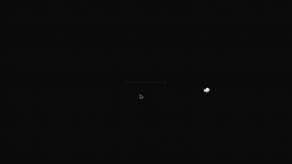

# 🐱 Cursor Pet

A cute, configurable cursor-following pet for React apps. Drop it in and a little cat chases your cursor around the screen.

**[Live Demo](https://cursor-pet.vercel.app/)**


---

## Demo

<div align="center">



*Move your cursor around and watch the little cat chase it!*

</div>

---

## Quick Start

```tsx
import { CursorPet } from '@/components/cursor-pet';

function App() {
  return (
    <>
      <h1>My App</h1>
      <CursorPet />
    </>
  );
}
```

That's it. A pixelated cat now follows your cursor. ✨

---

## Installation

```bash
git clone https://github.com/itslokeshx/cursor-pet.git
cd cursor-pet
npm install
npm run dev
```

### Integrate into your existing project

Copy these into your project:

```
src/components/cursor-pet/    → your component directory
public/pets/neko.gif          → your public directory
```

Then import and use `<CursorPet />` anywhere.

---

## API

### `<CursorPet />` Component

| Prop                   | Type      | Default            | Description                              |
| ---------------------- | --------- | ------------------ | ---------------------------------------- |
| `spriteUrl`            | `string`  | `'/pets/neko.gif'` | Path to the sprite sheet image           |
| `spriteSize`           | `number`  | `32`               | Size of each sprite frame in px          |
| `speed`                | `number`  | `10`               | Movement speed in px/frame               |
| `stopDistance`          | `number`  | `48`               | Distance (px) at which pet stops chasing |
| `startX`               | `number`  | viewport center    | Initial X position                       |
| `startY`               | `number`  | viewport center    | Initial Y position                       |
| `zIndex`               | `number`  | `2147483647`       | CSS z-index                              |
| `respectReducedMotion` | `boolean` | `true`             | Respect `prefers-reduced-motion`         |
| `enabled`              | `boolean` | `true`             | Toggle the pet on/off                    |
| `spriteSets`           | `object`  | —                  | Override default sprite animations       |
| `className`            | `string`  | —                  | Additional CSS class                     |

### `useCursorPet()` Hook

For full control, use the hook directly:

```tsx
import { useCursorPet } from '@/components/cursor-pet';

function MyComponent() {
  const petRef = useCursorPet({ speed: 15 });
  return <div ref={petRef} />;
}
```

Returns a `ref` you attach to any element. The hook handles all animation logic internally.

---

## Configuration Guide

### Change Starting Position

By default the pet spawns at the **center of the screen**. Pass `startX` and `startY` to override:

```tsx
// Top-left corner
<CursorPet startX={32} startY={32} />

// Bottom-right area
<CursorPet startX={window.innerWidth - 50} startY={window.innerHeight - 50} />

// Fixed position
<CursorPet startX={200} startY={400} />
```

### Change Size

`spriteSize` controls the frame size of the sprite sheet. Make sure your sprite sheet frames match this value:

```tsx
// Default (32×32 pixels per frame)
<CursorPet spriteSize={32} />

// Larger sprite sheet with 48×48 frames
<CursorPet spriteUrl="/pets/large-cat.gif" spriteSize={48} />

// Smaller 16×16 sprite
<CursorPet spriteUrl="/pets/tiny-cat.gif" spriteSize={16} />
```

### Change Speed

`speed` is how many pixels the pet moves per animation frame. Higher = faster:

```tsx
// Slow and relaxed
<CursorPet speed={5} />

// Default
<CursorPet speed={10} />

// Fast and energetic
<CursorPet speed={20} />
```

### Change Stop Distance

`stopDistance` is how close (in px) the pet gets to the cursor before it stops and goes idle:

```tsx
// Stops right at the cursor
<CursorPet stopDistance={16} />

// Default — stops a bit away
<CursorPet stopDistance={48} />

// Keeps its distance
<CursorPet stopDistance={100} />
```

### Change Z-Index

Control stacking order if the pet gets hidden behind other elements:

```tsx
// Default — sits on top of everything
<CursorPet zIndex={2147483647} />

// Behind modals
<CursorPet zIndex={100} />
```

### Toggle On/Off

Conditionally enable or disable the pet:

```tsx
const [showPet, setShowPet] = useState(true);

<button onClick={() => setShowPet(!showPet)}>Toggle Pet</button>
<CursorPet enabled={showPet} />
```

### Disable for Reduced Motion

By default the pet respects `prefers-reduced-motion`. To override:

```tsx
// Always animate regardless of OS setting
<CursorPet respectReducedMotion={false} />
```

### Combine Multiple Options

```tsx
<CursorPet
  speed={8}
  stopDistance={30}
  startX={100}
  startY={100}
  spriteSize={32}
  zIndex={9999}
/>
```

---

## Project Structure

```
src/
├── main.tsx                     # Entry point
├── App.tsx                      # Demo app
├── index.css                    # Global styles
└── components/
    └── cursor-pet/
        ├── index.ts             # Barrel exports
        ├── CursorPet.tsx        # Drop-in component
        ├── useCursorPet.ts      # Core logic hook
        └── types.ts             # TypeScript types & defaults
public/
└── pets/
    └── neko.gif                 # Default sprite sheet
```

---

## Custom Sprites

You can use any sprite sheet — just pass the URL and frame size:

```tsx
<CursorPet spriteUrl="/pets/my-dog.gif" spriteSize={48} />
```

---

## Tech Stack

- **React 19** — Hooks-based architecture
- **TypeScript** — Full type safety
- **Vite** — Fast dev server & builds

## License

MIT — see [LICENSE](LICENSE) for details.
